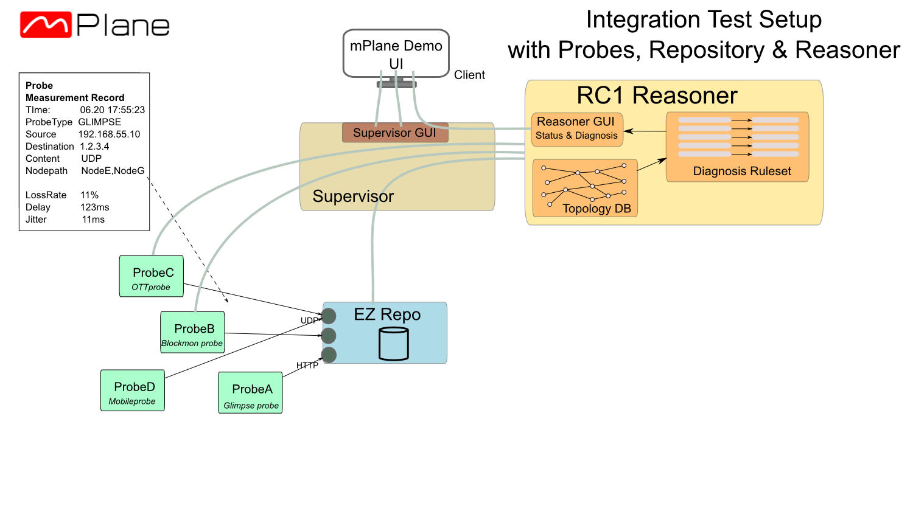

# RC1 Reasoner
# Measurements for Multimedia Content Delivery

## Installation

We give here a brief description about how to setup and launch the mPlane components needed for the Measurements for Multimedia Content Delivery Use Case. The functionality and operation of the RC1 reasoner is described on the [official mPlane website](https://www.ict-mplane.eu/public/rc1-reasoner).

- **Launch supervisor...:**

```
./scripts/mpsup --config conf/supervisor.conf
```

**or supervisor GUI:**

```
python3 -m mplane.svgui --config conf/svgui.conf
```

The configuration file of the `svgui` is backward compatible with those of the supervisor, so `svgui.conf` can be used in place of `supervisor.conf`.)

- **Launch the EZrepo repository:**

```
python3 -m mplane.ezrepo --config conf/ezrepo.conf
```

- **Launch the RC1 reasoner:**

```
python3 -m mplane.rc1 --config conf/rc1.conf
```

Reasoner will output diagnostic results in the launch terminal window. (The functionality to display reasoner messages in supervisor GUI is under further investigation.)

- **Launch the needed probe(s):**

```
./scripts/mpcom --config conf/component.conf
```

To enable the use of repository by the probes, we should define a *repository uri* where component should send the collected data too, in addition to the normal data exchange flow. It has to be defined in the `[module]` section of the probe's config file, like

```
...
[module_ott]
module = mplane.components.ott-probe.ott
ip4addr = 91.227.139.40
repository_uri = udp://91.227.139.40:9000
...
```




It is possible to launch several probes which connect to the same supervisor-repository-reasoner triplet, as shown on picture. Their launch parameters depend on the platform the probes run on: e.g. in case of Linux machines you can launch them the same way like shown above, just having adjusted the configuration file before starting them; on Miniprobes one can launch the probes either remotely, or by using Miniprobe's GUI.
